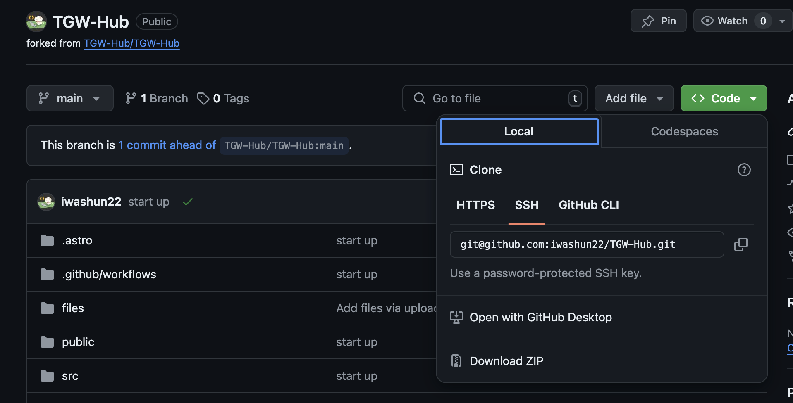

# プロジェクトの進め方

## 始めに・・・

> これは使わなくても出来ますが、このプロジェクト含め、これから先使うたくさんのライブラリのダウンロードを避けれるため、おすすめのツールです。　もちろん使わなくても大丈夫ですが、その場合だと機内にライブラリをインストールする必要があります。

まずは [Docker](https://docker.com.products/docker-desktop) をインストールしてください。
お使いのCPUのプロセッサを選択してください。


## プロジェクトに取り組む

Githubにあるリポジトリに直接触れないでください。まずはフォークをして、自分のプロジェクトとして管理します。


その後に自分のレポジトリをクローンします。



- 何か変更したい場合は必ず自分のリポジトリにプッシュしてください。
- それからプルリクエストを作ってください。

<video width="500px" controls muted>
  <source src="./manual-images/pull-request.mov">
</video>

## 環境設定

先ほどインストールしたDockerを立ち上げます。ターミナルで扱っているプロジェクトのフォルダーに移動してください。
```sh
  cd my/path/TGW-Hub
```

Dockerコンテナを作り、コンテナ内に入って環境を設定します。
```sh
# Docker コンテナを立ち上げる　（仮想マシン）
docker compose up -d
# Docker コンテナの中に入る
docker compose exec app bash
# 必要のパッケージをインストール　（機械に保存されません）
yarn install
```

Dockerをインストールしていない場合はそのままパッケージをインストールしてください。
```sh
yarn install
```

コマンドが見つからない場合はNode JSがまだ入っていないので、インストールしてください。
完了したら先ほどのコマンドをもう一回打ってください。
```bash
# nvm　のインストール (Node Version Manager)
curl -o- https://raw.githubusercontent.com/nvm-sh/nvm/v0.40.0/install.sh | bash
# Node.js　のインストール (ターミナルを再起動する必要があるかもしれません)
nvm install 20
```

## 開発する

Astro のライブラリを使ってローカルのWebsiteを立ち上げます。
```sh
yarn dev
```